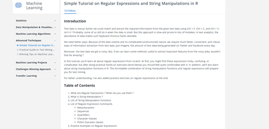
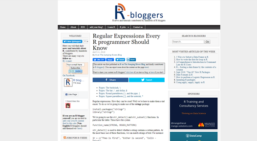
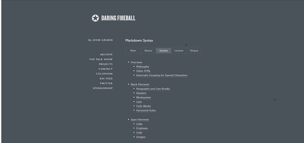
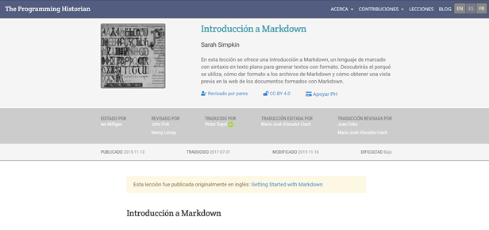

```{r setup, include=FALSE}
knitr::opts_chunk$set(echo = TRUE)
library(ggplot2)
library(DT)
library(readr)
library(highcharter)
library(dplyr)
library(rmdformats)
theme_set(theme_light())
fish.tidy <- read_csv("recursos/fish_tidy.csv")
fish.species <- read_csv("recursos/fish_species.csv")
```

# Sección de regex

Al empezar buscar dos páginas para comparar, como meta tenía explorar hasta 10 páginas y ver que es lo que ofrecía cada una. Las evalué en el contenido que proveen, la estética de la página en sí y ejercicios o ejemplos para poder revisar lo entendido. De esas diez llegue a reducirlo a las dos requeridas, las cuales tienen como objetivo enseñarle al lector cómo usar las expresiones regulares (Regex), una lo reduce hasta lo más básico mientras que la otra trata de enseñar todo al lector de una manera abrumadora.

Otra cosa que aprendí aunque algo obvia, es que no con leer el artículo llegas a aprender todo lo necesario de las Regex. Hay un mundo de maneras en las que son usadas, y bastante necesarias en el mundo de Big Data. Se necesitan más de uno, dos o hasta 10 artículos para volverse experto.

Sin más preámbulo las dos páginas:


**Primera página**  
La primera es del sitio https://www.hackerearth.com y su URL es:  
https://www.hackerearth.com/practice/machine-learning/advanced-techniques/regular-expressions-string-manipulation-r/tutorial/  



**Pros:**

- La manera en la que se presenta la información está hecha en un formato que es tenue y no molesta.

**Cons:**

- Es bastante largo el artículo.
- Se presentan demasiadas funciones y caracteres para enseñar cuales existen, en lugar de poner los más importantes.
- Tarda mucho en poner ejercicios que sean más complicados que solo mostrar lo que hace la función de manera sencilla.


**Segunda página**  
La segunda es del sitio [r-bloggers.com](http://r-bloggers.com) y su URL es:  
[https://www.r-bloggers.com/regular-expressions-every-r-programmer-should-know/](https://www.r-bloggers.com/regular-expressions-every-r-programmer-should-know/)



**Pros:**

- El artículo es breve y va directo al punto.
- Poco a poco construye sobre los conceptos que se van estableciendo.
- Empieza con un problema que poco a poco se va resolviendo con lo aprendido.
- Presenta lo mínimo, pero necesario para empezar por el camino de las Regex.

**Cons:**

- La página está cargada con información lo cual puede distraer o hasta hacer que el lector se sature.

***

# Sección de Markdown

Al igual que con la sección anterior encontré varias fuentes para filtrarlas a tan solo dos recursos que dieran a entender como se usa markdown. La primera página aunque completa, hace que el tema se vea aburrido, mientras que la segunda juega más con 


**Primera página**  
La primera es del sitio [hackerearth.com](daringfireball.net) y su URL es: 

[https://daringfireball.net/projects/markdown/syntax](https://daringfireball.net/projects/markdown/syntax)  



**Pros:**

- La página toca los puntos esenciales de markdown.
- El diseño es sencillo.

**Cons:**

- El contenido se siente muy monótono ya que no hay mucho cambio de los grises y blancos que se usan.
- Por lo mismo se siente que es eterno el tutorial y no hay mucho cambio.

**Segunda página**  
La segunda es del sitio [programminghistorian.org](http://programminghistorian.org) y su URL es:

[https://programminghistorian.org/es/lecciones/introduccion-a-markdown](https://programminghistorian.org/es/lecciones/introduccion-a-markdown)



**Pros:**

- Cubre todos los puntos necesarios para poder usar markdown.
- El diseño y los ejemplos hace fácil de entender que está pasando

**Cons:**

- Le hace falta ejercicios para que pueda el lector ir practicando lo visto

***

# Sección para estudiar datos

## Gráfica

En esta sección usaré los datos de 7 especies de salmones capturados para mostrar una tabla y el gráfico de ggplot.

```{r echo =FALSE}
ggplot(fish.tidy, aes(Year, Capture, color = Species)) + geom_line() + labs(    x = "Año",  y = "Cantidad de salmón pescado", title ="Salmón pescado desde 1950 hasta 2010", color = "Especies")
```

## Gráfica con faceta

Y para la versión avanzada se usan las facetas y el tema para que se divida por especie.

```{r echo =FALSE}
ggplot(fish.tidy, aes(Year, Capture)) + geom_line(color = "blue3") + labs(x = "Año",  y = "Cantidad de salmón pescado", title ="Salmón por especie pescado desde 1950 hasta 2010") + facet_wrap(vars(Species))
```

## Gráfica dinámica

La tabla original de manera dinámica.

```{r echo = FALSE, warning=FALSE}
hchart(fish.tidy, "line", hcaes(x = Year, y = Capture, group = Species))
```

## Tabla dinámica

Junto con una tabla dinámica con todos los valores ordenada por años.

```{r echo =FALSE}
datatable(fish.species)
```